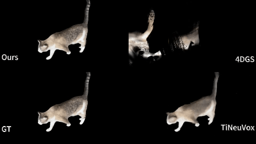
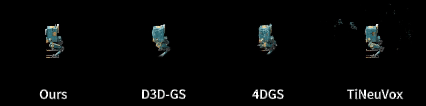
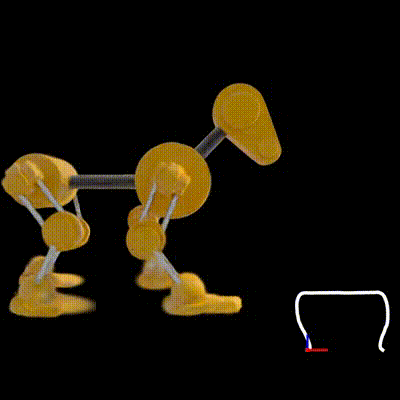
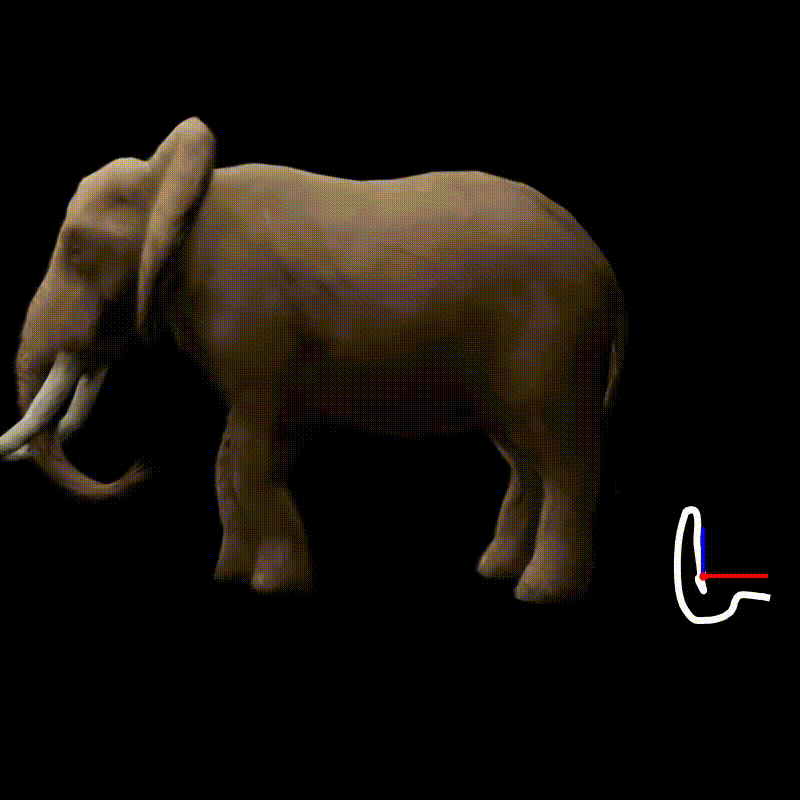
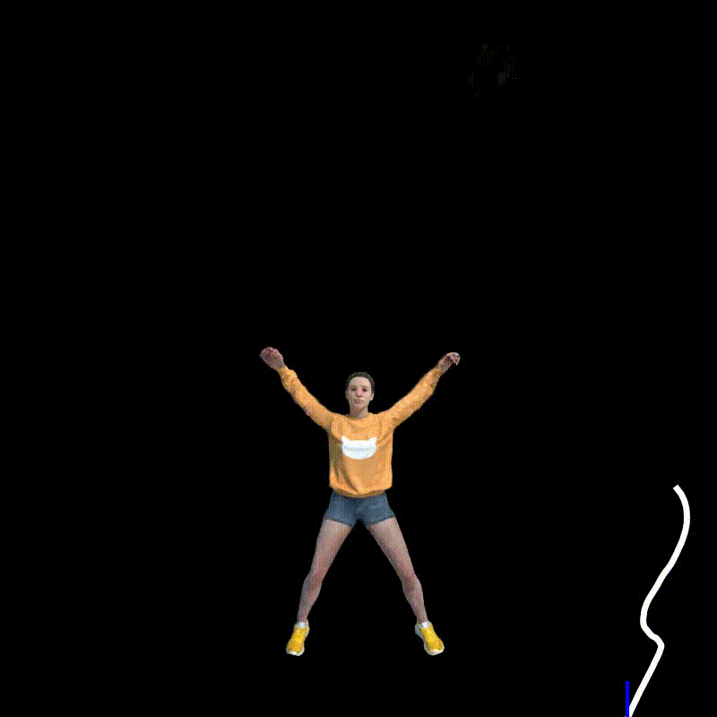

# M5D-GS
[AAAI 2025] The official implementation for the "Motion Decoupled 3D Gaussian Splatting for Dynamic Object Representation"

## Update
[2025.1.17] We are preparing the code and dataset. Please check back later.

[2025.02.03] The [dataset](/m5d_data) is available for download.

## Pipeline

<b><i>Figure.</i></b> <i>The workflow of M5D-GS. The 3D-GSs for each step and the ground truth images are also visulized</i>

The 3D-GSs are first transformed by the object level motion to form the overall motion. Then, each 3D-GS is modified by per-Gaussian deformation to capture local deformations

## Results
### Comparison with SOTAs

<b><i>Table.</i></b> <i>Quantitative comparison with previous SOTA methods.</i>

<b><i>Figure.</i></b> <i>Visual comparison with previous SOTA methods.</i>

### Estimated Object Motion
   

<b><i>Figure.</i></b> <i>Visualization of the estimated object motions. The white curves are the estimated trajectories, red spots are the location, and the rgb frames represent the orientations.</i>

## Dataset
See [this page](/m5d_data) for details.

## Code
TBD
