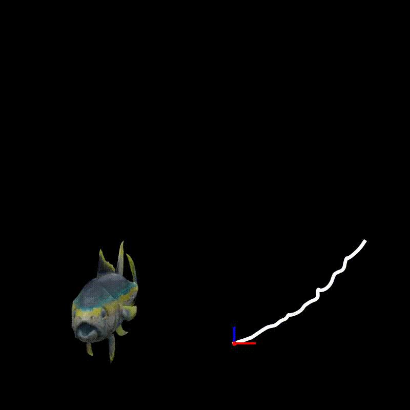

# M5D-GS
[AAAI 2025] The official implementation for the "Motion Decoupled 3D Gaussian Splatting for Dynamic Object Representation"

## Update
[2025.1.17] We are preparing the code and dataset. Please check back later.

[2025.02.03] The [dataset](/m5d_data) is available for download.

## Dataset
See [this page](/m5d_data) for details.
